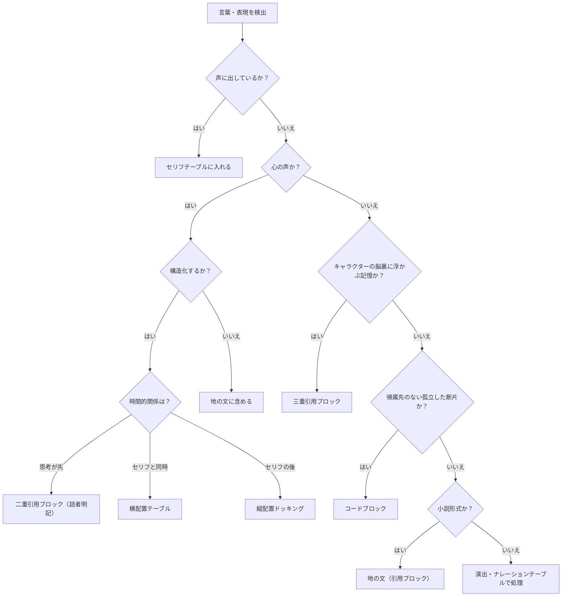

## 第2章：核心原則

### 2.1 完全分離の原則

ストラクブルにおいて、セリフと非セリフ要素は完全に分離される。混在は許容しない。

### 2.2 セリフの判定基準

「声に出した言葉」のみがセリフとしてテーブルに入る。

| 種別     | 判定   | 理由       | 備考                     |
| ------ | ---- | -------- | ---------------------- |
| 発話     | セリフ  | 声に出している  | セリフテーブルに記載（第4章・第5章参照）  |
| 心の声    | 非セリフ | 声に出していない | 三手段の構造化方式あり（第3章・第4章参照） |
| 地の文    | 非セリフ | 語り手の記述   | 引用ブロックで構造化（第3章参照）      |
| ナレーション | 非セリフ | 語り手の記述   | 台本形式で使用（第5章参照）         |
| 記憶の断片  | 非セリフ | 声に出していない | `>>>`で構造化（第3章参照）       |
| 孤立した断片 | 非セリフ | 帰属先なし    | コードブロックで構造化（第3章参照）     |

### 2.3 心の声の扱い

心の声は「声に出していない」ため、セリフ列には入れない。Ver. 3.0では、心の声を構造的に表現する三つの手段が存在する。

|時間的関係|手段|形式|帰属ルール|
|---|---|---|---|
|思考が先、発話が後|`>>` 引用ブロック|`>> 【話者】心の声`|【話者】明記（必須）|
|セリフと同時|横配置|テーブル3列（話者｜セリフ｜心の声）|話者列で明示|
|発話が先、思考が後|縦配置|話者列に「心の声」と記載しドッキング|直前のセリフの話者に帰属|

上記の三手段は心の声を構造的に明示する場合の選択肢である。構造化せず地の文（`>`）に心の声を含めることも引き続き有効であり、必ずしも三手段を使用する必要はない。詳細は第4章（小説形式）を参照。

### 2.4 判定フロー

### 2.5 原則の一覧
 
 ストラクブルを支える原則を以下に整理する。
 
| 原則       | 内容               | 参照        |
| -------- | ---------------- | --------- |
| 完全分離     | セリフと非セリフを混在させない  | 2.1       |
| 判定基準     | 声に出した言葉のみがセリフ    | 2.2       |
| 話者明示     | 全てのセリフに話者を明記する   | 4.1 / 5.1 |
| 心の声の分離   | 心の声はセリフ列に混入させない  | 2.3       |
| 演技指示の分離  | 演技指示はセリフ列に混入させない | 5.1       |
| 地の文の話者明示 | 地の文に視点人物を明記する    | 3.2 / 4.3 |

---
